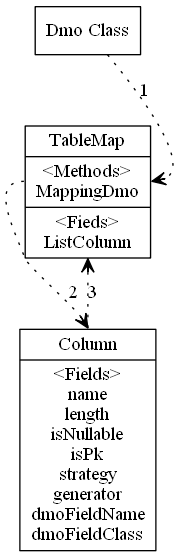

#Theta ORM(TORM)---基于MyBatis实现及JPA定义的适应企业快速生产轻量级ORM扩展

author : 陈望旭

email : <ranger.ying@gmail.com>

organization : Theta Group@NJU

----

##绪论

###1、研究背景与动机
　　数据库是所有商业应用系统的核心所在，数据访问层的开发在系统开发中的重要性也不言而喻。由于几乎现在所有的生产中都采用面向对象语言，ORM（对象关系映射）就显得非常重要。ORM并不仅仅提高了生产效率，较低了开发成本，同时也在保证了应用数据及数据操作与实际数据库数据及数据操作的一致性的基础上，将双方解耦。

　　由于关系型数据库已经发展得非常成熟，相关的数据访问层框架也非常丰富全面，通过针对各自系统的具体分析，完全可以轻易找出符合开发需要的ORM框架。很多优秀的ORM框架在映射上做了非常完备的处理，以满足传统关系型数据库的需要。但是在当前企业级开发过程的数据库设计中，有着与传统关系型数据库设计迥然不同的特点，导致“完备”有时候反而成为了缺点。学术上，虽然满足1NF就是关系型数据库了，但一般讨论到数据库设计，都会要求其达到3NF甚至是BCNF。实际生产中，由于考虑到访问效率、数据迁移和开发维护成本等方面的因素，往往会对所有的关系（表）加入逻辑主键以满足2NF；同时，在非核心数据的设计上会使用大量的冗余，即使是在多关系的数据模型中，也往往会使用非物理形式外键形式（仅仅以属性来做关联标识）。这也就意味着，企业级的数据库设计其实绝大部分情况下是不满足也不需要满足3NF的，而是一种在2NF基础上的松散关联设计。

　　与此同时在企业级的应用开发中往往存在这样的情况：95%以上的数据库访问可能只是简单的增删改查，余下的5%却是核心业务逻辑中比较复杂的数据处理过程。面对这种情况，一套完整的ORM方案就更显得有些臃肿了。为此，我们需要的是一种既能满足快速开发、简单操作无配置化，又能满足复杂操作可充分灵活定制的数据访问层框架，这也就是本文即将展开的内容。同时，我们将这个框架的解决方案命名为TORM（Theta ORM）。

###2、研究目的与意义
　　因为Java是目前世界上使用最为广泛地面向对象语言，所以本文将以Java为例来探讨、解决研究背景中所讨论的问题，并进行TORM的设计与开发。
　　
####现有解决方法
　　在目前使用Java语言的数据库访问层框架中大致分为两类：

* 以动态SQL为方向，如[MyBatis](http://mybatis.github.io/)。这一类框架支持普通SQL操作，大部分在执行前还会进行必要的优化、连接控制等，像MyBatis这类业界比较优秀的同时还能进行默认或自定义的POJO(Plain Old Java Objects的映射)。但由于其本质还是动态SQL框架，所以并没有直接实现SQL本身的封装，开发者需要对SQL进行直接或者以模板为基础的定义；
* 以完整的ORM为方向，如[Hibernate](http://www.hibernate.org/)。这一类框架则按照一些预定义的映射规则接口集合进行关系的属性与操作映射，当定义了DMO（数据模型对象）之后，在相应资源中定义数据库关联的具体映射规则，就可以使用DMO进行数据访问，并不需要再另外编写SQL。但是当其面对复杂的数据操作过程时，由于关系结构与对象结构本质上的不一致，往往会导致操作性能急剧下降。如果开发人员对此类情况经验不足或设计有所疏漏，实际应用中得数据模型与数据库中的数据模型不一致就变得很难避免且难以发现，大大增加了开发和维护的成本。

####现有问题分析和优化可能
　　如上文所述，一个矛盾产生了：

* 如果我使用动态SQL向框架，针对那简单的大多数场景，为了实现数据操作，我们要对应用中定义的DMO编写动态SQL生成实例，而这些实例在应用中生成出来的具体SQL却是大量类似的基础SQL，它们数量庞大、难以维护；
* 如果我们使用ORM向框架，针对那复杂的较少数，我们很难让数据库最终执行高效（而且大量的事实告诉我们很多时候这不仅不高效甚至不正确）的操作，虽然有些ORM框架，如Hibernate，也集成了部分动态SQL功能，但并不是特别理想，无法和传统的动态SQL向框架相比。　　

　　所以目前摆在我们面前是事实是，虽然我们在两方面都有成熟而强大的解决方案，但是面对实际生产的时候我们却不能仅仅通过选择来实现我们的全部需求。又由于已有的良好基础，我们解决问题的方案很容易得出，就是针对其中一种框架，添加另一类框架的功能子集以满足我们的需求，而对此我们选择也有两条：

* 基于Hibernate添加动态SQL支持。Hibernate自身带有其定义的HQL，但HQL只是语法类似SQL，本质上是基于面向对象进行设计的，所以必要路径还是在Hibernate的ORM上。那我们扩展的方式只有通过对Hibernate底层的调用执行SQL，比如数据库会话或数据库连接。但这样我们除了SQL操作本身的封装外，还需要重新定义POJO的映射规则，并且无法利用到Hibernate本身的优化机制；
* 基于MyBatis添加ORM支持。由于MyBatis本身支持POJO的高级映射，所以从核心层面上讲我们需要的只是将SQL操作封装成对象操作，相比对Hibernate的扩展复杂度和成本都大大降低了。而且对MyBatis的扩展是添加ORM部分，而完成映射之后，再进行实际数据访问都可以直接通过MyBatis已有的SQL加载和执行机制，在性能和安全性上都不需要额外的开销。

　　由此可见，基于MyBatis添加ORM支持是目前可见的最为理想的解决方案。

####需要解决的问题与挑战
　　确定了研究方向之后，也并不是就可以直接展开对MyBatis的扩展工作，由于MyBatis本身没有ORM功能，而上文中我们也简述了企业开发中数据访问层的特殊性，所以我们要做的不仅是实现，更包含了关系运算子集的定制、对定制子集的适用性证明以及为一些不属于关系代数范畴的数据库特性定制扩展的预留设计。按照研究进行的步骤，有一些核心的问题需要我们去解答：

* 如何定义满足企业需求的关系运算子集？
* 如何证明该集合在本文指定条件下与传统数据操作包含的关系运算集合等价？
* 如何在数据访问层定义满足上述关系运算子集的ORM映射规则？
* 如何设计并实现将POJO映射为为封装SQL操作提供传参的关系对象？
* 如何在不过大的影响Mybatis原有性能的前提下加入ORM层封装？
* 如何使这种改造具有较好的扩展性以便解决以后可能需要处理的特殊情况？

###3、研究的应用背景
　　因为TORM将会使用MyBatis作为扩展基础，所以无疑MyBatis是该应用背景最为重要的元素。然而我们对其扩展的方向是添加较为标准的ORM支持，所有TORM还会采用业界使用最为广泛地JPA（Java Persistence API）标准，进行映射相关的设计与实现。
####MyBatis
　　MyBatis早年是Apache的一个开源项目iBatis, 2010年这个项目由Apache Software Foundation迁移到了Google Code，并改名为MyBatis。

　　MyBatis是支持普通SQL查询，存储过程和高级映射的优秀持久层框架。MyBatis封装了几乎所有的JDBC代码和参数的手工设置以及结果集的检索。MyBatis使用简单的XML和注解用于配置和原始映射，将接口和Java的POJOs映射成数据库中的记录。这种POJO映射可以被TORM直接使用于SQL封装的过程中，而且几乎不需要引入新的改变，唯一可能要添加的过程只是对POJO属性映射的重命名而已。大部分使用MyBatis的开发者都会使用MyBatis的XML Mapper映射定义形式，但这种传统方法并不能满足我们的需要，因为MyBatis在SqlSessionFactoryBuilder中加载XML定义是封闭的，无法满足我们对映射定义随时加载的需求。所幸的是，MyBatis还提供了接口形式的映射定义（即上文所说基于注解的配置和原始映射），也就意味着如果我们能自行生成相关动态类的话，我们就可以随时在JVM ClassPool中加载其映射定义接口，从而加载TORM中的映射实现。

　　同时，MyBatis另外一个重要的特性就是它提供了丰富的插件接口，使得我们原本基于MyBatis的实现有了轻松扩展的可能。Mybatis采用责任链模式，通过动态代理组织多个拦截器（插件），通过这些拦截器可以改变Mybatis的默认行为。而我们的ORM实现最终是通过MyBatis的动态SQL生成接口实现，也就是说，在拼接完成SQL之后的所有一系列应用动作和数据库动作我们都可以通过MyBatis插件的形式进行扩展。并且这些扩展都是可拆卸的，只要设计良好，甚至可以做到与TORM本身无耦合，那也就以为着相对而言，我们为TORM进行扩展甚至可以直接使用一些现有的MyBatis插件源码。

####JPA
　　JPA全称为Java Persistence API。JPA通过JAVA注解(或XML)描述ORM，并将运行期的实体对象持久化到数据库中。JPA相对JDBC或其他形式SQL封装主要优势包括：

* 标准化:JPA是JCP发布的J2EE标准之一，因此任何声称符合JPA标准的框架都遵循同样的架构，提供相同的访问API，这保证了基于JPA开发的企业应用能够经过少量的修改就能够在不同的JPA框架下运行。
* 容器级特性支持:在JPA框架中支持大数据集、事务、并发等容器级事务，这使JPA超越了简单持久化框架的局限，在企业级应用发挥更大的作用。JPA的这个特点对TORM来说非常重要，在使用JPA定义映射的前提下，如果使用TORM的应用切换到其他支持JPA标准的数据库访问层框架上，几乎可以不改动任何业务代码，而只需简单更新一下部分框架配置。
* 简单方便:设计JPA的主要目标之一就是提供更加简单的编程模型。而事实上JPA本身可以说只是一个（或一组）标准，在企业应用的业务代码中，我们会使用符合JPA标准的注解或XML定义实体，而TORM只是对其进行实现，使得TORM不用不过的考虑特殊业务场景需求，简化了TORM本身需要的设计和开发流程。在JPA中创建实体和创建Java类一样简单，没有任何的约束和限制，只要使用javax.persistence.Entity进行注释，JPA的框架和接口也都非常简单，没有太多特别的规则和设计模式的要求，开发者可以很容易的掌握。JPA基于非侵入式原则设计，因此可以很容易的和其它框架或者容器集成。
* 查询能力:JPA的查询语言是面向对象而非面向数据库的，它以面向对象的自然语法构造查询语句，可以看成是Hibernate HQL的等价物。JPA定义了独特的JPQL（Java Persistence Query Language），JPQL是EJB QL的一种扩展，它是针对实体的一种查询语言，操作对象是实体，而不是关系数据库的表，而且能够支持批量更新和修改、JOIN、GROUP BY、HAVING等通常只有SQL才能够提供的高级查询特性，甚至还能够支持子查询。对于这一条特性，实际上TORM是不会使用到的，因为我们设计TORM的初衷就是屏蔽简单且具有通用性的查询及非查询SQL。对于HQL或JPQL这种查询语言，我们完全可以弃之不用，而是在面对复杂查询操作的时候直接使用MyBatis的动态SQL能力，执行我们需要的数据库操作。
* 面向对象的高级特性:JPA中能够支持面向对象的高级特性，如类之间的继承、多态和类之间的复杂关系，这样的支持能够让开发者最大限度的使用面向对象的模型设计企业应用，而不需要自行处理这些特性在关系数据库的持久化。同JPA的查询能力一样，虽然这本身是JPA得一个诱人优点，但对于TORM存在的场景，这种特性也是不必要的。DMO之间复杂的继承、多态等关系会使得TORM的关系映射设计变得非常复杂，而TORM的实际场景绝大多数是不会使用到这些关系的。而且对于JAVA而言，如果使用注解形式的JPA定义，也会存在不同版本JDK中对注解继承原则不同解释的问题，影响其TORM的兼容性。
 
###4、论文结构
　　基于上文提出的问题以及我们研究的目的，本文的结构大致可以分为如下部分：

* 第一章：关系运算子集定义
* 第二章：对象关系映射定义
* 第三章：对象关系映射实现
* 第四章：TORM功能扩展性提供

##正文
###第一章 关系运算子集定义
####一 基础关系运算介绍
　　本文所讨论的关系运算限定为关系代数中定义的原始运算和域计算运算。而刚刚所指的关系代数不是Augustus De Morgan于1860年为代数逻辑提供的关系代数，而是计算机科学中一般所指的一阶逻辑分支，即闭合与运算下的关系的集合。而关系运算的本质就是其作用于一个或多个关系上来生成另一个关系。

　　在1970年E.F. Codd发表数据的关系模型之后，关系代数被广泛地用来设计和定义数据库查询语言或语言规范。由于我们只是希望利用其在数据库查询语言中的指导性作用来定义一组具有广泛适用性并且正确合理的关系运算子集，从而定义我们需要的ORM子集，所以本文中我们并不关心关系代数的系统论证，将更多地去利用基础的关系代数定义去证明我们选取的运算子集能适用于一般的企业级开发，并在用所含运算模拟未包含运算时进行优化设计。

　　关系代数中定义的原始运算定义并不唯一。因为对于任何代数而言，一些运算是原始的，另一些运算则可以通过原始运算来定义。而这些运算的选取，除了需要符合常人的思维习惯之外，某种程度上来说是随机的。 Codd对他的代数原始运算做出的选取为“选择”、“投影”、“笛卡尔积”、“并集”、“差集”和“重命名”。在此基础上，我们根据一般SQL操作定义的情况，将这7个运算分为两类：

* 传统集合运算：并集，差集（交集可用差集定义）；
* 关系专用运算：选择，投影，笛卡尔积，重命名。

　　而根据我们实际的设计需要，我们又将所有这7个运算按操作对象集合分为一元关系运算与多元关系运算两类：

* 一元关系运算：选择，投影，重命名；
* 多元关系运算：并集，差集，笛卡尔积。

　　本章中，我们将对这七类原始运算进行分析，并根据我们对TORM的需求来取舍，并定义我们需要的运算子集。

####二 一元关系运算（单表）集合定义
#####1、投影
######定义
　　投影是写为 $$$ \pi_{a_1,...,a_n}(R) $$$的一元运算，这里$$$ a_1,...,a_n $$$是属性名字集合。这种投影的结果为当前所有在$$$R$$$中的元组被限制为$$$ \\{a_1,...,a_n\\} $$$的时候所获得的集合。

######分析
　　根据定义，投影可以简单理解为数据库中对表字段的选取，而这是所有非聚集查询运算中必然包含的操作之一，这些都分装在已经定义的SQL当中，不再需要我们处理。而当进行ORM时，我们也需要根据我们对象实体的属性在数据库表字段的基础上再进行一次投影，使得DMO中仅包含实体所需要的属性值。

######结论
　　投影运算作为关系运算的必要原始运算，将在我们的关系运算子集中定义，但我们不会在系统中实现它，因为他已经被SQL本身完整地实现了。

#####2、选择
######定义
　　广义选择是写为$$$ \sigma_\varphi(R) $$$的一元运算，这里的$$$ \varphi $$$是由正常选择中所允许的原子和逻辑算子$$$ \wedge $$$（与）、$$$ \vee $$$(或)和$$$ \lnot $$$（非）构成的命题公式。这种选择选出R中使$$$ \varphi $$$成立的所有元组。

######分析
　　选择运算是所有数据库查询操作的基础。从定义中可以看出，在关系代数中选择运算只包含逻辑谓词谓词，而实际数据库操作中可能会包含一些业务需要的非逻辑谓词。这也是因为关系代数与实际数据库在查询结果上有本质的区别：关系代数的关系运算结果为集合，集合为无序的；实际数据库中的操作结果为数据序列，这些序列或显式或隐式地包含了一定的有序关系。

######结论
　　考虑到实现的复杂度，在我们的关系运算子集定义中，不定义非逻辑谓词的选择操作（也无法定义）。非逻辑谓词的选择操作我们则会通过数据库访问层插件或为查询结果对象添加AOP切面来实现。

#####3、重命名
######定义
　　重命名是写为$$$ \rho_{a / b}(R) $$$的一元运算，这里的结果同一于$$$R$$$，除了在所有元组中的$$$b$$$字段被重命名为$$$a$$$字段之外。它被简单的用来重命名关系的属性或关系自身。

######分析
　　重命名在Codd提出他定义的关系代数原始运算时被忽略了，而实际上在对不同的关系进行运算时，关系间的重名属性会导致运算的定义存在二义性，所以重命名在ISBL提出时被显著地包括了。同样，在实际数据库中在进行数据库操作时，为了避免表属性同名的问题，也会使用重命名操作。不过我们在进行ORM时，操作的表空间对象限定为与应用一一对应，而同一个表空间中不会有同名表，所以只需采用加上了表名的字段全路径就可以区别。

　　但实际上，关系属性其实没有关系的特征，换句话说关系属性本身和关系之间的关联是松散的，那也就意味着在数据库操作中的字段全路径其实本身也是经过了默认的重命名运算。所以我们在ORM时对DMO属性和数据库字段的映射其实也是为其做了一次重命名运算。

######结论
　　重命名运算也是关系运算的必要原始运算，将在我们的关系运算子集中定义，我们将在系统中提供其默认的实现，更复杂的重命名运算将作为扩展另作实现。

####三 多元关系运算分析及在该场景下的处理方式
　　TORM主要是针对企业级开发在单关系（单表）处理时的操作简化，并不需要对多元关系运算提供完整地支持。虽然在现有的ORM框架中，多元关系操作一直饱受诟病，但TORM作为一个标准ORM框架，并考虑到其今后的扩展性，我们需要在定义其关系运算集合时考虑到多元操作。即使我们目前的实现并不以一定要包含这些运算，但我们需要保证，在一个可切入的扩展层面上TORM对多元操作而言是具有良好扩展性的。

#####1、多元运算的应用场景分析

######笛卡尔积
　　关系代数中的笛卡尔积定义与集合论有所不同，这里的元组是平坦的、无子元组的（可参考1NF的定义）。集合论中$$$n$$$元组与$$$m$$$元组的笛卡尔积是$$$2$$$元组，而关系代数中他们的笛卡尔积把这个$$$2$$$元组平展为$$$n+m$$$元组。形式上，$$$R \times S$$$被定义为:
$$
R \times S = \\{r \cup s| r \in R, s \in S\\}
$$
　　而在关系代数中，我们一般不会使用到原始的笛卡尔积运算，因为如上式定义的笛卡尔积运算中两个关系不能有公共属性，那这样的运算结果对业务而言是没有意义的。绝大多数的场景下，我们会选择具有至少一个公共属性的两个关系进行运算，而这就是我们一般所说的连接（join），记为$$$\bowtie$$$。

　　在关系代数中，连接还有一种特殊形式。设$$$\theta$$$是在集合$$$ $$$中的二元关系，$$$\\{a,b\\}$$$是关系属性，$$$v$$$是常量，当连接$$$R \bowtie S$$$满足逻辑谓词$$$a \theta b $$$或$$$a \theta v$$$时，我们称这种连接为$$$\theta -$$$连接，写为$$$R {\overset{\bowtie}{\_ {a \theta b}}} S$$$或$$$R {\overset{\bowtie}{\_ {a \theta v}}} S$$$。但在实际数据库中并不需要也往往没有定义$$$\theta -$$$连接，因为我们可以通过将连接退化为笛卡尔积再进行用等价谓词进行选择来模拟$$$\theta -$$$连接，记为：
$$
R \bowtie _\theta S = \sigma _ \theta (R \times S)
$$

　　除此之外，我们将连接按照算子运算对象所指关系的属性投影方式，可将其分为连接（内连接）与外链两类，出去刚刚所说的自然连接，其中包含:

* 半连接:分为左内连$$$R \ltimes S $$$和右内连$$$ R\rtimes S$$$。半连接的结果只是在$$$S$$$中有在公共属性名字上相等的元组所有的$$$R$$$中的元组。其形式定义如：$$$R \ltimes S = \\{ t : t \in R, s \in S, fun (t \cup s) \\}$$$。* 半连接可被自然连接模拟，取$$$a1,...,an$$$是$$$R$$$的属性名，则有$$$R \ltimes S = \prod _ {a1,..,an}（R\bowtie S）$$$。
* 反连接:反连接记为$$$ R \triangleright S $$$。反连接的结果是在$$$S$$$中没有在公共属性名字上相等的元组的$$$R$$$中的那些元组。反连接还可以定义为半连接的补集:$$$R \triangleright S=R-R \ltimes S$$$,所以半连接也可以被自然连接加投影模拟。
* 外连接:外连接包括左外连、右外连、全外连，它们是由内连接结果元组加上通过向一个操作数的未匹配元组扩展上另一个操作数的每个属性的“填充”值而形成的元组组成。根据外连接的定义，它也可以通过自然连接加投影进行模拟。

　　由此可见，所有的连接运算都可以由基础的自然连接和基于自然连接的选择和投影来模拟，也就是说，如自然连接满足某条件，那用该自然连接模拟其他连接满足某条件的步骤不会多于一次额外的选择及投影。那么我们在以后的讨论中将只分析自然连接的情况。

######并、差集
　　关系代数中的并集和差集运算与集合论中的并集和差集运算定义一致，但添加了一个附加条件，即需要参与运算的两个操作数关系同构。所以，当仅仅讨论关系代数时，并、差操作在集合论中的运算律，在关系代数运算中存在包含投影的子式时，分配律和幂等律将不再适用。但实际数据库中的情况则较为理想化，因为数据库中需要做集合运算时，往往都是有人为的先天限制的，不同构的关系间的集合运算对业务本身没有意义，而且在存在并、差的运算中，其包含投影的运算子式也必然是对两个异构的关系进行同构映射，这时候的并、差运算就退化为集合论中的并、差运算。

　　而我们在ORM中，即使数据库中表同构，应为对象实体并不一定同构，所以我们也将其视为异构，因此我们也不会对其进行并、差运算。这就意味着我们的集合运算算子永远出现在同一个关系的两个选择之中，因此根据分配律能很简单的推导出：
$$
\begin{align}
& 1. \sigma _ a (R) \cup \sigma _ b(R)=\sigma _{a \vee b}(R)\\\
& 2. \sigma _ a (R) - \sigma _ b(R)=\sigma _ {a \not\rightarrow b}(R)
\end{align}
$$

　　所以，在本文讨论的所有关系运算中的集合运算，都可以通过合并过逻辑谓词的选择运算来模拟，则本文不再讨论并、差集等关系集合运算算子。

#####2、关联运算的取舍分析
　　上文在并、差集的讨论中我们已经分析了在特定情况下的使用一元关系运算对多元关系运算可模拟性。但这还是代数层面的模拟，而在此层面上，笛卡尔积相应的各种关联操作无法通过纯粹的多次选择或投影来模拟。这是不是意味着我们的关系运算子集中必须包含关联这样的多元运算来满足我们的需求并保证日后的扩展性呢？

######一次多元运算和多次一元运算的等价关系
　　事实上，除了代数层面的等价关系外，如果我们不去过分追求高效、简洁的逻辑表述和高性能的数据库实现，而是考虑到企业级应用中复杂关联查询的稀有性，我们还有另外一个方案：通过单次一元关系运算的运算结果来重组后继一元关系运算的逻辑谓词，并在最终结果中使用之前已运算的中间结果拼接成最后的关系结果。除此之外，如果满足以下两点假设：

* 将关系$$$R$$$与关系$$$S$$$中最大属性元组$$${a_1,...,a_n}$$$ 及其任意非空真子集视为同一运算结果；
* 对于关系$$$R$$$与关系$$$S$$$的所有关联运算都可以通过$$$\theta -$$$关联中不同的逻辑谓词来模拟实现。

　　则我们可以做出以下推导：
$$
\begin{align}
& \forall R,S,定义有
 R \bowtie _ \theta S  =  \\{r \cup s:r \in R,s \in S,f _ \theta(t \cup s)\\}
，\\\
& \\ 当假设一种拆分
f _ \theta(t \cup s)=f _ {\theta_1}(t,s) \wedge f _ {\theta_2}(t) \wedge f _ {\theta_3}(s)，\\\
& \\ 找出使且其满足的
\begin{cases}
f _ {\theta_1}(t,s)=f _ \phi(t,s)\\\
f _ {\theta_2}(t)=f _ {\phi_1}(t)\\\
f _ {\theta_3}(s)=f _ {\phi_2}(s)\\\
\end{cases}时，\\\
& \exists
R \bowtie _ \theta S=\\{r \cup s:r \in R,s \in S,f _ \phi(t,s) \wedge f _ {\phi_1}(r) \wedge f _ {\phi_2}(s)\\}=\sigma _ \phi(\sigma _ {\phi_1}(R) \times \sigma _ {\phi_2}(S)) \\\\
& \\ 根据选择和叉积的分配律，并析取逻辑谓词，可得R \bowtie _ \theta S=\sigma _ { \phi \wedge \phi_1}(R) \times \sigma _ { \phi \wedge \phi_2}(S)
\end{align}
$$

　　显然，当满足上文中两点假设时，连接操作可以分解为两个选择结果的叉积。对于关系型数据库而言，这样的模拟运算是无法完成的，因为有两点限制：第一，最终运算式中包含了叉积运算；第二，找出的替代逻辑谓词中同时包含两个关系的逻辑条件。但是我们可以采取非常简单的措施来规避这一问题。

* 对于逻辑谓词：先分别进行无耦合的选择运算，在运算结果的选择中，对另一组结果进行逐条遍历并判断，模拟叉积运算
* 对于最终的叉积
	+ 内半连接：退化为单关系与常量关系的叉积，即不需要进行叉积运算
	+ 自然连接与外连接：可以暂时不进行叉积运算，而是在系统中使用时通过遍历来获取某一条结果元素

######多元运算和与其等价的一元运算的实际时空复杂度分析
**时间复杂度**

　　因为所有复杂的关系运算最终都由有限的原始运算组成，所以分析其复杂度时，我们需要首先定义原始运算的复杂度，而数据库中的时间复杂度主要来自于选择与叉乘，因此不妨做出如下设定：

* 选择：$$$T _ \sigma (R)$$$
* 笛卡尔积：$$$T _ \times (R,S)$$$

　　据此，对于真正的连接而言其复杂度为：
$$
T _ \bowtie (R,S)=T _ \times (R,S)+T _ \sigma (R \times S)\\\
$$

　　而对于上文中使用多次选择模拟的连接运算复杂度为:
$$
设m=count(\sigma(R)),n=count(\sigma(S)),\\\
有T _ \bowtie '(R,S)=nT _ \sigma (R)+mT _ \sigma(S)
$$

　　可见，一般情况下，两种方式的复杂度并无明显可比性。但显然，当$$$R$$$、$$$S$$$有一个或者两者都较小时，$$$T _ \bowtie (R,S) < T _ \bowtie '(R,S)$$$,而当m和n，即选择结果集合规模远小于$$$R$$$、$$$S$$$，且原始关系规模很大时，反而有$$$T _ \bowtie (R,S) > T _ \bowtie '(R,S)$$$（如果生产经验比较丰富，可以看出这是一种很常见的数据库访问优化的背景)。

　　一般而言，除了数据分析的场景之外，大部分应用场景都是在大量的数据中找出有限的条目，这种情况下，我们的模拟运算是可以接受甚至更优的。

**空间复杂度**

　　同空间复杂度一样，由于选择操作的拆分，空间复杂度上同样会出现因为关系$$$R$$$与关系$$$S$$$本身的规模及其选择结果的规模差别而产生的复杂度差别，并这种差别与时间复杂度分析中是同趋的，即一般情况下模拟的开销略大，而对选择结果远小于原始关系规模的情况则模拟方法占优。

　　由于我们的应用场景并不适用大量数据的分析和筛选，而除去这种场景，现在计算机的存储空间一般可视为充足的，所以对于其空间复杂度这里不再多做分析。

####四 小结
　　经过以上分析，在TORM的关系运算子集中，我们有如下结论：

* 保留一元关系运算，即投影、选择和重命名;
* 多元关系运算中的集合运算不保留，通过运算中算子的逻辑谓词合并来实现;
* 笛卡尔积及相关连接运算不保留，简单的连接运算通过一元关系运算模拟，或在TORM的扩展级中通过插件形式实现，复杂的连接运算则直接通过框架的源生动态SQL功能实现。

###第二章 ORM定义
　　本章中，我们将会对TORM的对象关系映射做出定义，而定义的基础是第一章的关系运算子集定义，定义的依据则是JPA现有的ORM标准，其中包括其注解、接口和解释。需要注意的是因为我们只是对一元运算进行了定义并将对其采取映射，所以只会用到JPA的一个较小子集，同时，我们采用Apache旗下的[OpenJPA](http://ci.apache.org/projects/openjpa/trunk/docbook/manual/main.html)文档作为JPA的解释入口。

####一 属性映射定义
#####1、 实体
######描述
　　这里的实体指的是元数据(MetaData)中的实体。实体是ORM的核心，实体是对关系的业务抽象，他对应了在应用系统中的对象及其属性。而我们在TORM中针对实体本身不再进行查询操作，所以可以将应用中的DMO对应为我们需要的实体，反之亦然。同样，因为上述原因，实体本身将只做定义，而没有相关操作的实现，所以TORM中我们将其定义为DMO的逻辑标记，没有相关参数。
######注解级别
类级
######注解属性
无
######注解形式
	@Entity
	class public ClassName();
#####2、表
######描述
　　表处于对象关系映射的过渡节点，是关系在数据库中的最重要体现形式，是关系映射到对象过程中实际访问客体，所以TORM中需要定义实体的表注解，以标明其映射关系，对应到相应的实际关系中去。
######注解级别
类级
######注解属性
* name：表名，标注该实体映射对应数据表，必需；
* schema：表空间命，标注数据表所在表空间，缺省为当前数据库连接使用表空间。

######注解形式
	@Table(name="TableName",schema="SchemaName")
	class public className();
#####3、列
######描述
　　列对应于关系中的关系属性，而其在对象中表型形式为对象的成员属性。列是元数据中存储数据的最小单位，而在TORM中的列注解将定义其数据内容先关标注，将关系中关系属性的特征，如主键，分离为其他注解，使对象成员属性与表字段有一般性的对应关系。
######注解级别
域级
######注解属性
* name：列名，标注该实体映射中对应数据字段名，必需；
* length：最大长度，该字段数据的最大内容长度；
* nullable:是否可为空，该字段值是否可为空值。

######注解形式
	@Table(name="TableName",schema="SchemaName")
	class public className(){
		@Column(name="ColumnName",length="255",nullable=true)
		private Object field;
	}
#####4、主键
######描述
　　注解注解用于描述对象中映射属性的主键描述，而非键值本身。所以该注解也是一种标识行注解，依赖于列注解，且不含任何参数。
######注解级别
域级
######注解属性
无
######注解形式
	@Table(name="TableName",schema="SchemaName")
	class public className(){
		@Id
		@Column(name="ColumnName",length="255",nullable=true)
		private Object field;
	}
#####5、键值生成策略
######描述
　　在执行对象持久化操作时，每个属性到数据库字段的映射会存在一个自身的生成策略。默认的持久化策略为直接获取对象中的属性值，这就不需要额外的定义。而有时，我们希望对部分字段的生成采用某种规则进行特殊处理，这时候就需要键值生成策略注解来标注这种规则。
######注解级别
域级
######注解属性
* strategy:生成策略，选取自预定义的生成策略集合，标注该域使用的生成策略;
	+ AUTO:默认策略，应用容器或其他调用者主动赋值；
	+ SEQUENCE:使用序列生成，需要Oracle等支持序列的数据库系统支持；
	+ TABLE:使用表字段生成，需预定义特殊生成所需表及生成字段；
* generator:生成器名，如生成策略需指定生成器生成，则需该属性标注。

######注解形式
	@Table(name="TableName",schema="SchemaName")
	class public className(){
		@Id		
		@GeneratedValue(strategy=GenerationType.SEQUENCE,generator="GeneratorName")
		@Column(name="ColumnName",length="255",nullable=true)
		private Object field;
	}

####三 映射规则定义
#####1、属性数据类型
　　依然是依据尽量广泛适用且简单的规则，在做类型映射时，我们原则上参考三条规则：

* 永远只考虑从对象属性类型向数据库数据类型的转化。相反的，对象属性类型中不存在的类型也不应该存在于TORM的映射规则中；
* 永远只使用应用框架语言的非基础类型。如果使用基础类型作为映射源，会使Java中的泛型处理极大的复杂化；
* 永远只使用原子对象属性类型进行映射。因为数据表中的字段根据1NF定义应该是不可拆分的数据内容，所以做对象属性映射时，我们需要将对象实体的属性定义拆分至原子级别。如果业务中需要使用不同层次设计的对象实体，应当对映射源实体进行再次封装；如果数据库中字段数据内容具有特殊格式且含有有业务意义的拆分可能，应当在应用上层添加相关解析代码。

#####2、数据模型对象定义约束
　　根据Java本身的面向对象特性以及ORM的一些特点，我们对实际的映射数据模型对象进行定义时，我们需要保证映射的源端类满足：

* 非虚类，因为映射汇端的数据库表为存在实体，所以源端对象也必须可实例化；
* 继承链末端，因为Java8之前对注解继承的机制本身不完善，所以在使用TORM这样基于注解的数据库访问层解决方案时，考虑到不同JVM版本的兼容性问题，我们应该避免源端类的注解被显式或隐式的继承，又由于需要保证数据的原始性，所以源端类也不该被继承以注入不同的实现；

#####3、操作映射的定义与形式
　　操作映射其实本身并不属于ORM定义的一部分，但最终我们的ORM实现必须依赖数据库操作执行，所以我们需要定义一组从对象操作到数据库操作的映射，从而实现最终的数据库操作。数据库操作不与关系代数运算一一对应，实际上SQL中的查询与非查询操作都是根据关系代数的理论规则来定义而通过已经产品化的RDBMS来实现的。

　　因为在第一章的关系运算子集定义中只定义了基于单关系的运算，所以查询操作的结构相对于一般的极大的简化了。而对于包含查询从句的非查询操作，因为其在对象映射关系上的复杂性我们亦不予考虑，所以无论是查询或是非查询操作，我们都可以简单的以以下形式描述：

	[操作符]+[属性集]+[介词集]+[谓词集]

　　具体的操作实现我们将在TORM的系统实现中详细描述。

####四、小结
　　本章根据已确定的关系运算子集，加之对TORM所面对的应用场景的考量，进行了在TORM中对象、关系两侧的属性定义，并对映射规则及操作映射的定义与形式进行了简单约束。

###第三章 ORM实现

####一 数据模型对象相关
　　在ORM的定义中，我们其实已经对DMO的定义做出了描述，但作为数据库访问层框架，只有DMO的映射定义是不够的，因为对象与数据库中的关系毕竟是异构的，无法直接提供给应用的SQL生成来使用。所以，同时我们还要定义在应用中的符合数据库关系结构的对象定义，并提供上述两者对象之间转化的方法。

#####1、数据模型对象定义
　　DMO的定义在属性映射定义中已经根据其相关注解做出了初步描述，所以这里不再描述注解的具体意义，而是只描述其类结构：

* DMO定义需满足一般POJO定义形式；
* DMO定义中，参与映射域需根据数据库中对应关系的特征给予相应注解描述，不参与映射域不应与映射域存在数据相关性；
* DMO定义中，参与映射域需包含完整的setter/getter方法，但不限定为直接定义或框架切面添加；
* DMO的域值中，剔除原有的NULL值意义，因为在数据库中引入NULL值会涉及到三值逻辑的判断，与对象表现不一致。

#####2、关系对象定义
　　这里所指的关系对象如上文所说，为对DMO进行数据访问操作时中间结构。在一次数据库访问操作中，对象实例的域值可以直接通过MyBatis的映射规则被SQL使用，所以关系对象中只需要通过类解析获取DMO对象结构，从而完成动态SQL结构的拼接。

　　同时，关系对象是处于对象至关系的映射过程之中，所以其本身也就代表一个关系，关系中的属性将通过在关系对象中将聚合一个内部类，来描述属性（列）的结构，并存储其属性特征。根据现有注解的定义，关系属性的内容结构为：

* name：属性名
* length：字段最大长度
* isNullable：可否为空
* isPk：是否为主键
* strategy：主键策略
* generator：主键策略生成器
* dmoFieldName：对象域名
* dmoFieldClass：对象域类型

#####3、对象转化
　　从DMO结构到关系对象的转化比较简单，因为没有参与映射域的注解继承关系，所以只需遍历DMO定义中的所有定义域，并解析其注解，然后存储到关系对象中即可。

　　其转化过程可简单以下图描述：

　　

　　
####MyBatis
#####MyBatis简介
#####MyBatis动态SQL的定义形式分析（采用接口形式）
XML形式（功能全面，不利于动态加载）
接口形式（功能不完整，动态加载较方便）
	纯接口（基于注解，不灵活）
	接口+SqlProvider（结构稍复杂，灵活）
#####动态SQL定义的生成与加载
#####定义的生成（源码级别）
接口定义
SqlProvider类定义
Sql模板定义
#####定义的加载
MyBatis懒加载
#####定义的执行
MyBatis一般执行形式
####小结

###ORM功能扩展性提供
不同层次的扩展性分析
####TORM源码扩展
#####数据对象解析扩展
注解扩展
数据模型对象读、写、初始化扩展
关系对象初始化扩展
#####MyBatis动态SQL接口扩展
模板扩展
SqlProvider扩展
接口方法扩展（不需要）
#####比较重要的待扩展项
适应常用复杂度的JOIN操作定义扩展
####MyBatis插件扩展
#####MyBatis插件对TORM执行的兼容性分析
#####已有扩展的设计与描述
数据库方言
数据字段加解密
分页查询
#####比较重要的待扩展项
其他非逻辑定语的扩展
####暂时不确定的扩展
批量处理的扩展形式思考

##结论
###目前研究成果及意义
####MyBatis的ORM改造实现
基础单表功能的实现
可扩展性的提供
对企业级应用的价值
###未来继续完善的方向
不增加开发复杂度下的联查扩展
非逻辑定语相关功能的完善
动态Sql模板的优化或重构
批量操作的扩展
更多可移植性功能的切面方式分析